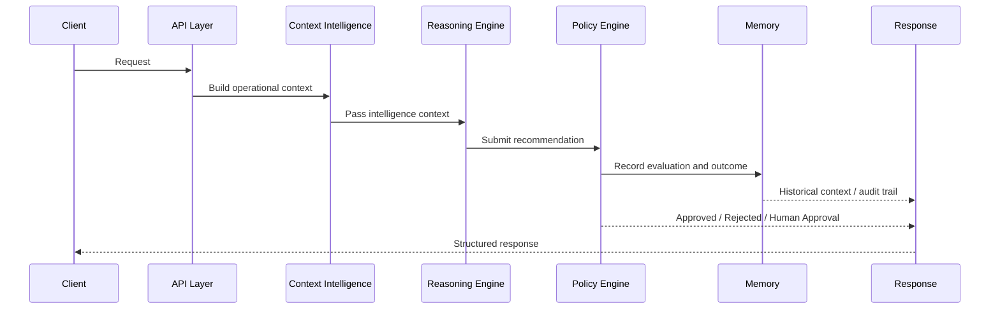

# AI-RAN Context OS

## 1. Vision
AI-RAN Context OS is an AI-native operating system for telecom networks. Its purpose is to turn fragmented operational data, inventory, alarms, KPIs, topology, policy, and historical experience into a unified, explainable, and actionable intelligence layer for network operations.

The platform is designed to help telecom organizations move from reactive incident handling to proactive, policy-aware, and AI-assisted decision-making. It combines synthetic telecom world modeling, context intelligence, reasoning, governance, and memory so that the system can understand network state, explain what is happening, recommend actions, and preserve operational knowledge over time.

In short, AI-RAN Context OS aims to become the control and reasoning backbone for intelligent telecom operations.

---

## 2. High-Level Architecture

AI-RAN Context OS is organized as a layered platform with a clear separation between system interfaces, domain intelligence, governance, and operational memory.

### Core Layers
- API Layer
  - Exposes REST endpoints for context, reasoning, policy, and memory workflows.
- AI Kernel (planned)
  - Future orchestrating intelligence runtime for multi-agent reasoning, planning, and execution.
- Context Intelligence
  - Builds a structured understanding of telecom context from operational signals and inventory data.
- Reasoning Engine
  - Converts context intelligence into root causes, recommendations, predictions, and decisions.
- Policy Engine
  - Governs whether a recommendation is approved, rejected, or requires human review.
- Enterprise Cognitive Memory
  - Retains operational history, decision history, policy outcomes, and learning signals.
- OpenAI Adapter
  - Provides a clean integration boundary for large-model capabilities without coupling the platform to a specific AI provider.
- Knowledge Graph
  - Represents relationships among telecom entities and supports richer context retrieval and reasoning.
- Synthetic Telecom World
  - Provides realistic synthetic inventory, behavior, and telemetry data to power development, testing, and simulation.

### Architecture Diagram
```mermaid
flowchart TD
    A[Client / Operator / UI] --> B[API Layer]
    B --> C[Context Intelligence]
    C --> D[Reasoning Engine]
    D --> E[Policy Engine]
    E --> F[Enterprise Cognitive Memory]
    C --> G[Knowledge Graph]
    D --> H[OpenAI Adapter]
    C --> I[Synthetic Telecom World]
    D --> J[AI Kernel
(planned)]
    E --> J
    F --> J
```

---

## 3. Package Structure

The backend is organized around modular packages so that each domain capability can evolve independently.

### Backend Packages
- app/main.py
  - Application entrypoint for FastAPI.
- app/api/
  - REST API routing and endpoint composition.
- app/models/
  - Canonical Enterprise Data Model platform for vendor-neutral entities, validation, serialization, versioning, mapping, and model APIs.
- app/connectors/
  - Universal Connector Framework for async enterprise integrations, discovery, lifecycle management, mock transport adapters, and canonical transformation.
- app/kernel/
  - Enterprise AI Kernel runtime for module registration, orchestration, execution pipelines, runtime health, and metrics.
- app/core/
  - Shared application configuration and logging infrastructure.
- app/schemas/
  - Shared request and response schema models for API contracts.
- app/services/
  - Existing service layer for general-purpose application capabilities.
- app/synthetic_data/
  - Synthetic telecom inventory and behavior generation framework.
- app/graph/
  - Knowledge graph abstractions and graph-oriented data handling.
- app/integrations/openai/
  - OpenAI adapter boundary with client, prompt, parser, and registry components.
- app/reasoning/
  - Domain logic for root cause analysis, recommendations, prediction, decision-making, and confidence.
- app/policy/
  - Policy loading, evaluation, approval level handling, and governance decisions.
- app/memory/
  - Enterprise cognitive memory for operational, decision, policy, learning, and business history.
- app/tests/
  - Cross-cutting backend tests and integration validation.

### Package Roles
- API package: handles external interfaces.
- Models package: provides canonical enterprise entities so downstream intelligence layers can remain vendor-neutral.
- Connector package: provides an extensible integration SDK and mock connector framework without changing core intelligence modules.
- Kernel package: coordinates existing intelligence modules without changing their business logic.
- Core package: provides shared runtime features.
- Synthetic data package: generates realistic telecom scenarios for development and testing.
- Reasoning package: provides explainable operational decision support.
- Policy package: provides governance and approval logic.
- Memory package: preserves operational experience and historical context.
- OpenAI adapter: isolates external AI capabilities from the platform core.
- Knowledge graph: models relationships and topology-driven insight.

---

## 4. Request Flow

A request enters the platform through the API layer and flows through a sequence of intelligence and governance components before a response is returned.

### Request Lifecycle
1. A client sends a request to a supported API endpoint.
2. The API layer parses and validates the request.
3. The request is routed to the relevant domain service.
4. Context intelligence assembles a structured understanding of the situation.
5. The reasoning engine generates root causes, recommendations, predictions, and decision posture.
6. The policy engine evaluates the proposed action against governance rules.
7. The memory layer records the interaction and preserves relevant history.
8. The final response is returned to the caller with structured results.

### Sequence Diagram


---

## 5. Module Responsibilities

### API Layer
Responsible for route handling, request validation, and shaping responses for external callers.

### Context Intelligence
Responsible for converting telecom inputs into a coherent operational context. It synthesizes signals such as inventory, KPIs, alarms, weather, topology, and service state.

### Reasoning Engine
Responsible for analyzing the context and producing actionable reasoning outputs, including root causes, recommendations, predictions, and decisions.

### Policy Engine
Responsible for applying organizational governance rules, approval thresholds, and safety constraints to recommendations.

### Enterprise Cognitive Memory
Responsible for storing operational history, decision traces, approvals, rejections, policy evaluations, and learning signals for future reuse.

### OpenAI Adapter
Responsible for isolating model interactions behind a stable interface so the platform can evolve to different model providers or transport implementations.

### Knowledge Graph
Responsible for representing relationships and dependencies across telecom entities, enabling topology-aware inference and deeper contextual understanding.

### Synthetic Telecom World
Responsible for generating realistic telecom scenarios with inventory, alarms, KPIs, weather, and maintenance patterns for testing and simulation.

### Core Infrastructure
Responsible for shared configuration, logging, and runtime support for the application.

---

## 6. Current Milestones

The platform has already implemented several milestone capabilities:

- Telecom inventory and synthetic network generation
- Context intelligence engine
- Reasoning engine
- Policy and governance engine
- Enterprise cognitive memory engine
- REST API exposure for each major capability
- Backend test coverage for the main platform workflows

These milestones establish the foundation for a broader enterprise AI platform.

---

## 7. Planned Roadmap

The roadmap extends the current platform into a full enterprise-grade AI operating system.

### AI Kernel
A future orchestrating intelligence runtime that coordinates specialized agents, workflows, and models.

### Enterprise Event Bus
A shared event backbone for asynchronous notification, streaming updates, and cross-domain integration.

### Learning Engine
A runtime that continuously learns from outcomes, feedback, and historical decisions to improve recommendations over time.

### Supervisor Agent
An oversight agent that monitors autonomous recommendations, validates safety, and escalates high-risk actions.

### Planner Agent
An agent responsible for long-range network planning, maintenance scheduling, and optimization scenarios.

### Multi-Agent Runtime
A runtime for coordinating multiple specialized agents across operations, planning, optimization, and governance.

### Digital Twin
A simulation environment that mirrors telecom network behavior for what-if analysis and predictive planning.

### Executive Dashboard
A business-facing intelligence surface that exposes service-health trends, risk posture, and decision outcomes.

---

## 8. Design Principles

### Clean Architecture
The platform is designed around distinct layers with responsibilities separated across APIs, domain services, models, and infrastructure.

### SOLID
The platform favors clear responsibilities, abstraction, extensibility, and dependency inversion where appropriate.

### Domain-driven package organization
Packages are organized around telecom and AI operating-system capabilities rather than technical implementation details alone.

### Dependency direction
Dependencies generally flow toward lower-level infrastructure and away from the API layer, supporting maintainability and future evolution.

### Explainability
Reasoning outputs should be understandable, traceable, and explainable rather than opaque black-box decisions.

### Extensibility
The platform is designed so that new capabilities such as agents, policies, memory types, and reasoning strategies can be added without reworking the whole architecture.

---

## 9. Testing Strategy

The current platform uses a layered testing approach:

- Unit tests for core engines and services
- API tests for route behavior and response contracts
- Integration-style tests to validate end-to-end workflows across the major backend packages

### Current Status
The backend test suite is currently passing, and the platform has a stable base for continued expansion.

---

## 10. Future Vision

The future vision for AI-RAN Context OS is to evolve from a modular telecom intelligence platform into an Enterprise AI Operating System for network operations. Over time, the platform will support:

- autonomous reasoning and decision support
- policy-driven governance and approvals
- multi-agent collaboration
- continuous learning from operational outcomes
- digital-twin simulation and scenario planning
- executive oversight and business-level operational intelligence

As the platform matures, it will become a strategic operating layer that helps telecom organizations run their networks more safely, predictively, and efficiently.
