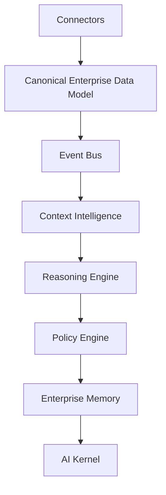

# Module Dependency Graph

## Platform Dependency Summary
The platform is organized so that data moves through the following dependency chain:

## Notes
- Connectors are the only ingress point for vendor payloads.
- Canonical models are the only objects allowed past connector transformation.
- The event bus provides the runtime backbone for asynchronous enterprise workflows.
- Downstream intelligence modules consume canonical entities only.