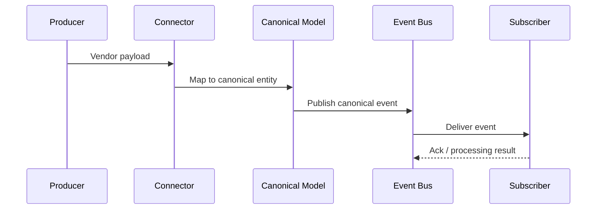
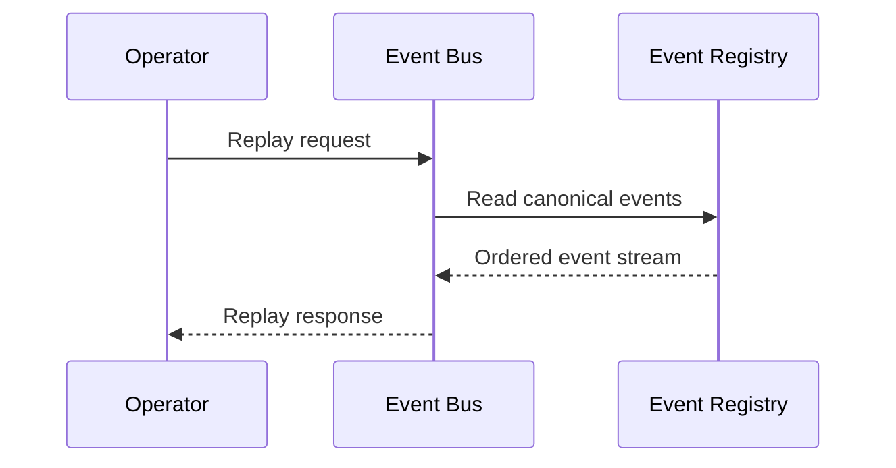
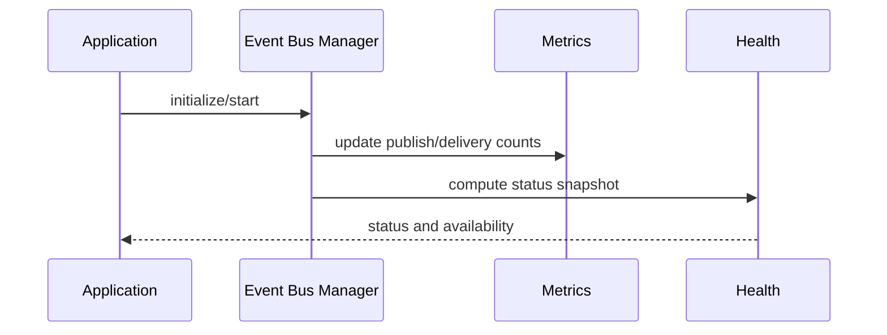

# Sequence Diagrams

## Event Publication

```mermaid
sequenceDiagram
    participant Producer
    participant Connector
    participant CanonicalModel as Canonical Model
    participant EventBus as Event Bus
    participant Subscriber as Subscriber

    Producer->>Connector: Vendor payload
    Connector->>CanonicalModel: Map to canonical entity
    CanonicalModel->>EventBus: Publish canonical event
    EventBus->>Subscriber: Deliver event
    Subscriber-->>EventBus: Ack / processing result
```

## Event Replay

```mermaid
sequenceDiagram
    participant Operator
    participant EventBus as Event Bus
    participant Registry as Event Registry

    Operator->>EventBus: Replay request
    EventBus->>Registry: Read canonical events
    Registry-->>EventBus: Ordered event stream
    EventBus-->>Operator: Replay response
```

## Runtime Coordination

```mermaid
sequenceDiagram
    participant App as Application
    participant Bus as Event Bus Manager
    participant Metrics as Metrics
    participant Health as Health

    App->>Bus: initialize/start
    Bus->>Metrics: update publish/delivery counts
    Bus->>Health: compute status snapshot
    Health-->>App: status and availability
```