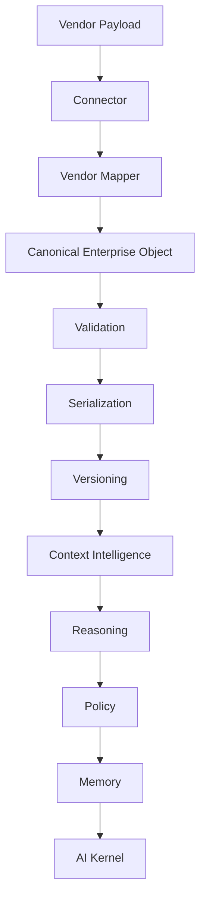

# Canonical Model Architecture

## Purpose
The Canonical Enterprise Data Model is the single source of truth for enterprise data moving through AI-RAN Context OS. Vendor payloads terminate at the connector layer and are converted into canonical enterprise objects before downstream consumption.

## Flow

## Boundaries
- No downstream engine needs vendor-specific awareness.
- New integrations extend mapper registration only.
- Connectors emit canonical objects or canonical object dictionaries only.