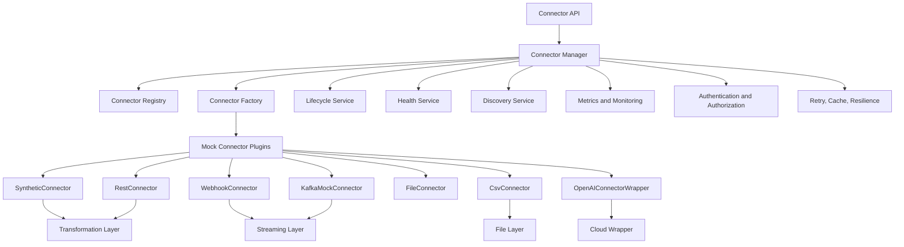

# Universal Connector Framework Architecture

## Purpose
The Universal Connector Framework is an enterprise integration platform for AI-RAN Context OS. It is isolated from Context Intelligence, Reasoning, Policy, Memory, Knowledge Graph, AI Kernel, and the LLM Gateway so future enterprise integrations can be added without changing those modules.

## Architecture
The framework is built as an async SDK with clean separation between contracts, lifecycle orchestration, registration, discovery, transformation, security abstractions, resilience, monitoring, and transport-specific mock adapters.

## Design Notes
- All public framework interfaces are asynchronous.
- Connectors are registered dynamically through the factory and registry.
- Future connectors only need a builder registration and a small subclass of the appropriate base connector.
- Vendor integration remains abstract through canonical transformation and mapping services.