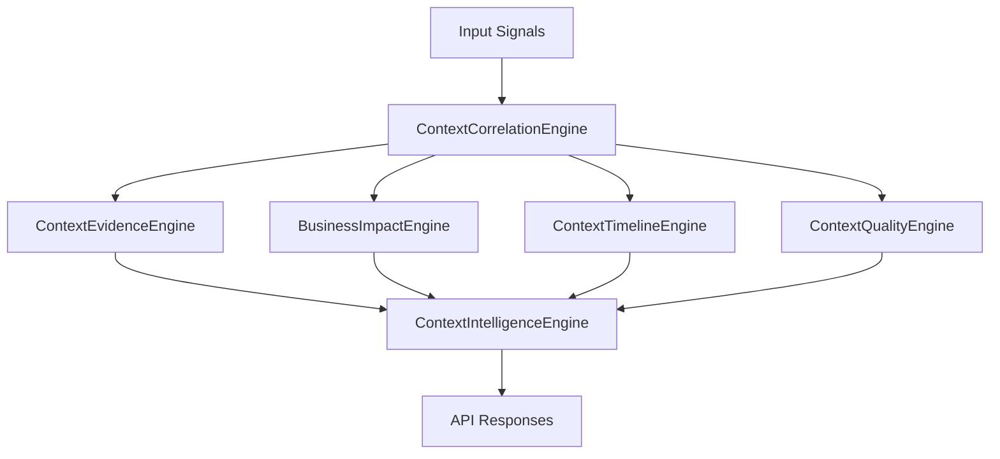

# Context Intelligence Engine Architecture

## Overview
The Context Intelligence Engine evolves the existing context builder into a richer reasoning layer that correlates operational signals and produces evidence-backed intelligence for telecom assets.

## Components
- ContextCorrelationEngine: combines KPI, alarm, weather, maintenance, topology, and traffic inputs into a correlation score.
- ContextEvidenceEngine: formats why/how/evidence/confidence/affected objects/timeline details.
- BusinessImpactEngine: estimates subscribers affected, revenue impact, SLA impact, coverage impact, risk, and priority.
- ContextTimelineEngine: returns historical, current, and predicted future context snapshots.
- ContextQualityEngine: scores completeness, freshness, confidence, consistency, and explainability.
- ContextIntelligenceEngine: orchestrates the above services into a single response payload.

## Mermaid Diagram

