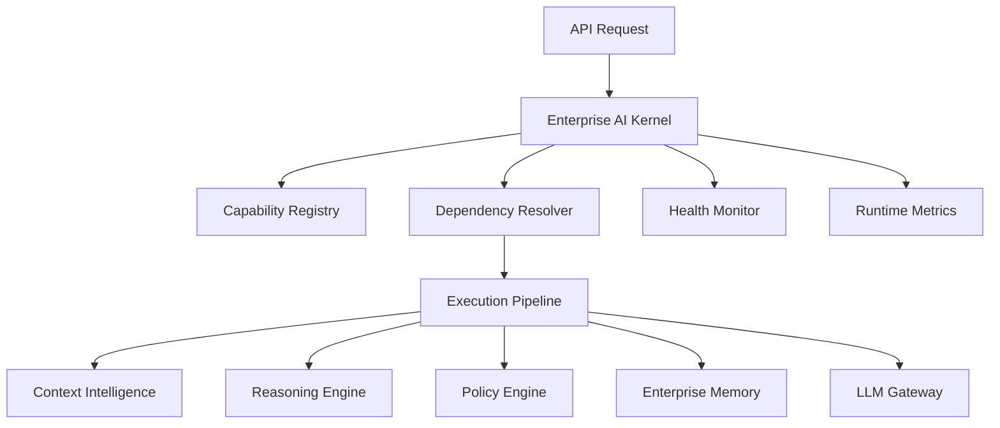

# Enterprise AI Kernel Architecture

## 1. Purpose
The Enterprise AI Kernel is the runtime coordination core for AI-RAN Context OS. It does not replace or modify existing business logic. Instead, it registers, discovers, orders, executes, and monitors the platform's existing domain modules.

The current kernel coordinates these existing modules only:
- Context Intelligence
- Reasoning Engine
- Policy Engine
- Enterprise Memory
- LLM Gateway

## 2. Responsibilities
The kernel provides the runtime control plane for:
- capability registry
- module registration
- module discovery
- request orchestration
- dependency resolution
- execution context management
- health monitoring
- runtime metrics
- pipeline execution
- plug-in loading

## 3. Package Layout
The runtime lives in `backend/app/kernel/`.

- `kernel.py`
  - runtime composition root and FastAPI router
- `registry.py`
  - module registry and capability registry
- `orchestrator.py`
  - dependency-aware orchestration logic
- `execution_pipeline.py`
  - ordered module execution and result capture
- `lifecycle.py`
  - startup, shutdown, and plug-in loading
- `health.py`
  - kernel and module health aggregation
- `metrics.py`
  - runtime execution counters and latency summaries
- `execution_context.py`
  - request, context, step, health, and response models

## 4. Runtime Model
The kernel wraps each existing module behind a small adapter with a common runtime contract.

Each adapter is intentionally thin. Translation between module contracts happens in the kernel, while the underlying engines remain unchanged.

## 5. Default Orchestration Flow
The default runtime pipeline is:

1. `context_intelligence`
2. `reasoning_engine`
3. `policy_engine`
4. `enterprise_memory` when persistence is requested

The kernel also supports direct execution of a single module. When a target module has dependencies, the kernel resolves and executes them first.

Examples:
- Executing `reasoning_engine` automatically runs `context_intelligence` first.
- Executing `policy_engine` automatically runs `context_intelligence` and `reasoning_engine` first.
- Executing `llm_gateway` runs independently unless placed in a custom pipeline.

## 6. Execution Context
Every request creates an execution context that carries:
- request identity
- target entity
- requested pipeline
- input payload
- execution metadata
- step-by-step results
- module artifacts
- final completion status

This keeps the orchestration layer traceable and explainable without coupling the modules to each other.

## 7. Plug-in Loading
Plug-ins are loaded during kernel startup through import paths in the form `package.module:function_name`.

The plug-in factory must return either:
- one runtime module adapter, or
- a list of runtime module adapters

The lifecycle manager validates the returned objects against the kernel runtime contract and then registers them with the module registry.

## 8. Health and Metrics
The health monitor aggregates:
- lifecycle state
- per-module health probes
- loaded plug-ins
- runtime metrics

The metrics service tracks:
- total executions
- successful executions
- failed executions
- per-module execution counts
- per-module failure counts
- average latency
- last execution timestamp

## 9. REST API
The kernel is exposed under `/api/v1/kernel`.

- `GET /kernel/health`
  - returns runtime health, module health, and metrics
- `GET /kernel/modules`
  - returns registered modules and supports capability-based discovery
- `POST /kernel/pipeline`
  - executes the default or caller-provided pipeline
- `POST /kernel/execute`
  - executes a target module with automatic dependency resolution

## 10. Testing Strategy
The kernel package is validated with:
- registry tests
- dependency resolution tests
- pipeline failure-path tests
- runtime orchestration tests
- API endpoint tests
- health and metrics tests

The tests focus on the kernel package itself so the orchestration layer can evolve independently while continuing to reuse existing domain engines.