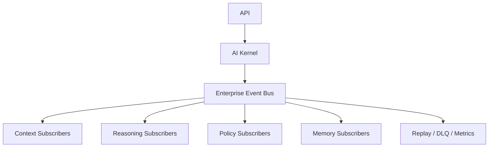

# Event Bus Architecture

## Purpose
The Enterprise Event Bus is the communication backbone for AI-RAN Context OS. It decouples modules through canonical event publication, routing, replay, and dead-letter handling.

## Core Runtime
- Event Publisher
- Event Subscriber
- Event Dispatcher
- Event Router
- Event Registry
- Event Store
- Event Replay
- Dead Letter Queue
- Retry Manager
- Event Scheduler
- Health Monitor
- Metrics Collector
- Correlation Manager

## Architectural Flow

## Canonical Rule
Every event payload must contain canonical enterprise models only. Vendor payloads are normalized before publication.# Event Bus Architecture

## Purpose
The Enterprise Event Bus is the async backbone for platform-wide event propagation. It supports canonical events, topic-based routing, subscriptions, replay, monitoring, and plugin-driven extension.

## Design Goals
- async-first interfaces
- canonical event ingress only
- minimal surface area for future plugins
- no vendor payloads inside downstream engines

## Relationship to the Platform
- Connectors publish canonical events.
- The event bus persists and routes canonical events.
- Downstream services consume event-derived canonical objects or use the bus for workflow triggers.

## API Surface
- `/events/status`
- `/events/health`
- `/events/topics`
- `/events/metrics`
- `/events/publish`
- `/events/subscribe`
- `/events/replay`

## Extension Model
Future integrations should implement new event subscribers or plugins, not custom logic inside core bus orchestration.