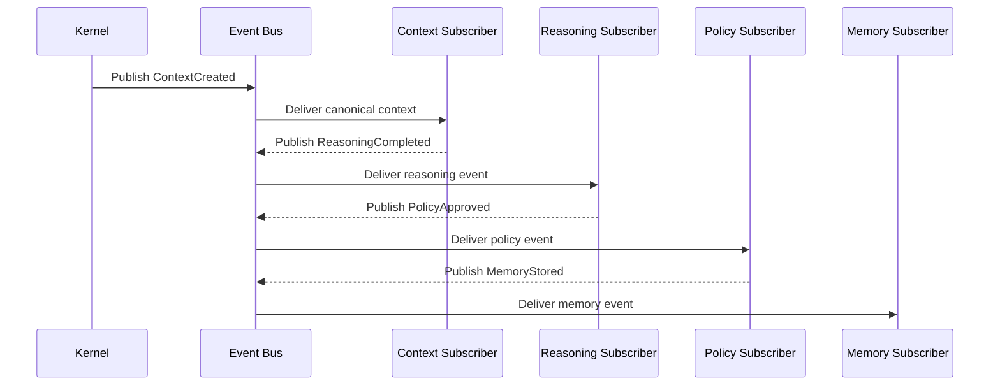
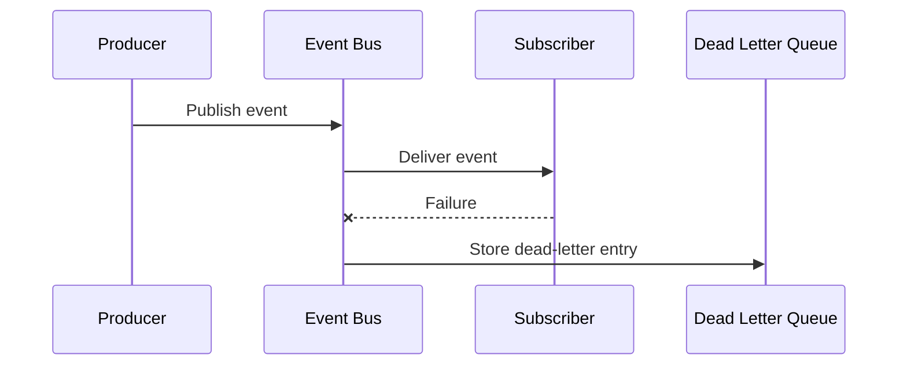

# Event Bus Sequence Diagrams

## Context to Reasoning to Policy to Memory

```mermaid
sequenceDiagram
    participant Kernel
    participant Bus as Event Bus
    participant Context as Context Subscriber
    participant Reasoning as Reasoning Subscriber
    participant Policy as Policy Subscriber
    participant Memory as Memory Subscriber

    Kernel->>Bus: Publish ContextCreated
    Bus->>Context: Deliver canonical context
    Context-->>Bus: Publish ReasoningCompleted
    Bus->>Reasoning: Deliver reasoning event
    Reasoning-->>Bus: Publish PolicyApproved
    Bus->>Policy: Deliver policy event
    Policy-->>Bus: Publish MemoryStored
    Bus->>Memory: Deliver memory event
```

## Failure and DLQ

```mermaid
sequenceDiagram
    participant Producer
    participant Bus as Event Bus
    participant Handler as Subscriber
    participant DLQ as Dead Letter Queue

    Producer->>Bus: Publish event
    Bus->>Handler: Deliver event
    Handler--xBus: Failure
    Bus->>DLQ: Store dead-letter entry
```