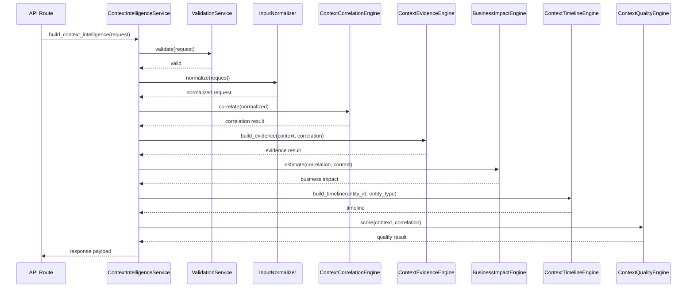

# Low-Level Design: Reasoning Engine

## 1. Purpose
The Reasoning Engine converts telecom operational signals into explainable intelligence outputs for a given entity such as a site, cell, sector, or market. It produces:
- correlation insight
- evidence-backed explanation
- business impact estimate
- timeline view
- quality assessment

The design is intended to support a future-ready, testable, and explainable reasoning pipeline without coupling the domain logic to the API layer.

## 2. Goals
- Provide deterministic, explainable reasoning outcomes.
- Separate orchestration from domain-specific reasoning logic.
- Keep the design extensible for future rules, policies, and model-driven scoring.
- Make the engine easy to unit test and validate.

## 3. Non-Goals
- Real-time streaming ingestion
- External persistence or database integration
- OpenAI prompt orchestration
- Full production-grade anomaly detection or ML training

## 4. High-Level Responsibilities
The engine will be composed of the following logical components:

1. Request Normalizer
   - Standardizes incoming input dictionaries and defaults missing values.
   - Validates required fields and basic shapes.

2. Context Builder
   - Constructs the core context object from normalized input.
   - Captures inventory, KPI, alarm, weather, and insight information.

3. Correlation Engine
   - Evaluates how strongly the observed signals indicate degraded or risky operational context.
   - Produces a numeric score and explainable evidence.

4. Evidence Engine
   - Formats the reasoning outcome into a narrative explanation.
   - Produces confidence and supporting evidence list.

5. Business Impact Engine
   - Converts correlation strength into subscriber and revenue impact estimates.
   - Produces SLA, coverage, risk, and priority levels.

6. Timeline Engine
   - Produces historical, current, and predicted future context snapshots.

7. Quality Engine
   - Scores how complete, fresh, consistent, and explainable the generated context is.

8. Orchestrator
   - Invokes the above components in a defined order.
   - Assembles the final response payload.

## 5. Proposed Component Structure

### 5.1 Domain Models
The engine should use explicit domain models instead of loosely typed dictionaries where possible.

- ContextIntelligenceRequest
  - entity_id: str
  - entity_type: str
  - inventory: dict
  - kpis: dict
  - alarms: dict
  - weather: dict
  - maintenance: dict | None
  - traffic: dict | None
  - topology: dict | None
  - neighbor_cells: list[str]
  - configuration: dict
  - subscribers: int
  - revenue_per_sub: float

- CorrelationResult
  - score: float
  - explanation: str
  - evidence: list[str]

- EvidenceResult
  - why: str
  - how: str
  - evidence: list[str]
  - confidence: float
  - affected_objects: list[str]
  - timeline: list[str]

- BusinessImpactResult
  - subscribers_affected: int
  - revenue_impact: float
  - sla_impact: str
  - coverage_impact: str
  - risk: str
  - priority: str

- TimelineResult
  - historical: list[dict]
  - current: dict
  - predicted_future: dict
  - entity_id: str
  - entity_type: str

- QualityResult
  - completeness: float
  - freshness: float
  - confidence: float
  - consistency: float
  - explainability: float

- ContextIntelligenceResponse
  - context: ContextObject
  - correlation: CorrelationResult
  - evidence: EvidenceResult
  - business_impact: BusinessImpactResult
  - timeline: TimelineResult
  - quality: QualityResult

### 5.2 Service Layer
- ContextIntelligenceService
  - Primary entry point for the reasoning workflow
  - Accepts a request model and returns a response model
  - Coordinates the execution of all lower-level engines

- ContextCorrelationEngine
  - Evaluates the signal set and returns correlation insights

- ContextEvidenceEngine
  - Converts correlation outcome into explainable evidence payload

- BusinessImpactEngine
  - Derives business impact from correlation score and context

- ContextTimelineEngine
  - Builds time-based context snapshots

- ContextQualityEngine
  - Assesses the quality of the generated context

### 5.3 Supporting Components
- InputNormalizer
  - Converts missing or malformed values into a consistent internal representation

- ValidationService
  - Enforces request invariants and constraints

- Exception Types
  - InputValidationError
  - ProcessingError
  - UnsupportedEntityTypeError

## 6. Data Flow
1. The API route receives a request for a given entity.
2. The request is validated.
3. The normalizer converts the request into a canonical internal shape.
4. The orchestrator creates the base context object.
5. The correlation engine evaluates the input signals.
6. The evidence engine translates the correlation into a narrative and confidence score.
7. The business impact engine estimates operational cost and service impact.
8. The timeline engine constructs historical, current, and predicted snapshots.
9. The quality engine scores the completeness and reliability of the output.
10. The orchestrator packages the outputs into the final response.

## 7. Sequence Overview

## 8. Validation Rules
The design should enforce the following validation rules:
- entity_id must be a non-empty string
- entity_type must be one of the supported values such as site, cell, sector, market, circle, or region
- numeric values such as subscribers and revenue_per_sub must be non-negative
- score values must remain within the range 0.0 to 1.0
- severity values should be normalized to known categories where possible
- empty or malformed input should not silently produce misleading output

## 9. Error Handling Strategy
Errors should be handled explicitly and returned as structured failures rather than silent defaults.

### Recommended error types
- InputValidationError
  - raised when required fields are missing or malformed
- UnsupportedEntityTypeError
  - raised when entity_type is not supported by the current policy
- ProcessingError
  - raised when an engine cannot compute a valid result

### Error behavior
- Return a structured error response with code, message, and context.
- Avoid swallowing errors in the orchestrator.
- Preserve enough context to support debug and traceability.

## 10. Observability and Diagnostics
The reasoning engine should expose the following operational signals:
- request_id for each invocation
- timing per engine component
- number of input signals processed
- final score and confidence values
- error codes and messages

Recommended observability hooks:
- structured logs for each stage
- metrics for request latency and failure rate
- tracing identifiers for downstream debugging

## 11. Extensibility Strategy
To support future evolution, the engine should be designed around pluggable reasoning components.

Recommended extension points:
- new scoring policies can be added as additional engines or strategies
- new output types can be added as additional response sections
- scoring weights and thresholds should be configurable rather than hard-coded
- policies can be versioned so that reasoning behavior can be audited over time

## 12. Testing Strategy
The design should support the following test categories:
- unit tests for each engine in isolation
- integration tests for full orchestration flow
- validation tests for malformed input
- contract tests for API response shape
- regression tests for threshold-based behavior and output stability

## 13. Implementation Notes for the Team
- Keep the orchestrator thin and deterministic.
- Avoid mixing response shaping with reasoning logic.
- Use typed models for all core domain objects.
- Keep the engine stateless where possible.
- Prefer explicit contracts over ad-hoc dictionaries.

## 14. Recommended Target Architecture
The implementation should align with the following structure:
- API layer: request handling and serialization
- Service layer: orchestration and workflow execution
- Engine layer: reasoning components
- Model layer: typed request/response objects
- Validation layer: input constraints and error mapping
